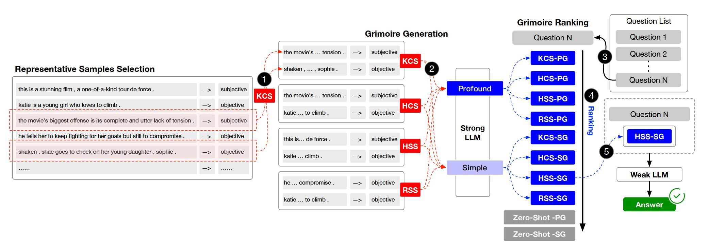
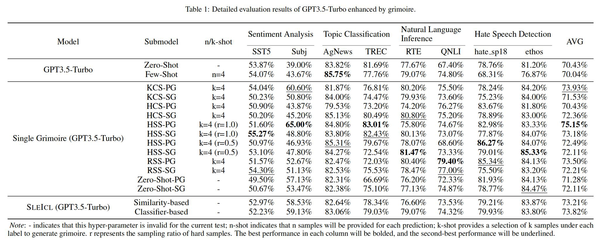
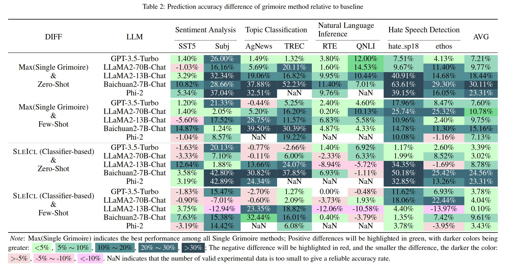

[English](./README.md) | [中文简体](./README.zh_CN.md)


<h1 align="center">
    📖 Grimoire is All You Need for Enhancing LLMs
</h1>
<p align="center">💡Enhance the capabilities of small language models using grimoires.
<p align="center">
<a href="https://opensource.org/license/apache-2-0/">
    
</a>
<a href="https://github.com/IAAR-Shanghai/Grimoire/issues">
    
</a>
<a href="https://arxiv.org/abs/2401.03385">
    
</a></p>

## Contents
- [Introduction](#introduction)
- [Project Structure](#project-structure)
- [Get Started](#get-started)
- [Results](#results)
- [Contact Us](#contact-us)
- [Citation](#citation)

## Introduction

In-context learning (ICL) is one of the key methods for enhancing the performance of large language models on specific tasks by providing a set of few-shot question and answer examples. However, the ICL capability of different types of models shows significant variation due to factors such as model architecture, volume of learning data, and the size of parameters. Generally, the larger the model's parameter size and the more extensive the learning data, the stronger its ICL capability. In this paper, we propose a method SLEICL (Strong LLM Enhanced ICL) that `involves learning from examples using strong language models and then summarizing and transferring these learned skills to weak language models for inference and application.` 

This ensures the stability and effectiveness of ICL. Compared to directly enabling weak language models to learn from prompt examples, SLEICL reduces the difficulty of ICL for these models. Our experiments, conducted on up to eight datasets with five language models, demonstrate that weak language models achieve consistent improvement over their own zero-shot or few-shot capabilities using the SLEICL method. Some weak language models even surpass the performance of GPT4-1106-preview (zero-shot) with the aid of SLEICL.

<p align="center"></p>

## Project Structure
The project is organized into several key directories and modules. Here's an overview of the project structure:
```
.
├── archived      # Store the grimoire and hard samples used in our experiment.
├── assets        # Store project assets, such as images, diagrams, or any visual elements used to enhance the presentation and understanding of the project.
├── configs       # Store configuration files.
├── core          # Core codebase.
│   ├── data      # Data processing module.
│   ├── evaluator # Evaluator module.
│   └── llm       # Load Large Language Models (LLMs) module.
├── data          # Store datasets and data processing scripts.
├── external      # Store the Grimoire Ranking model based on the classifier approach.
├── outputs       # Store experiment output files.
├── prompts       # Store text files used as prompts when interacting with LLMs.
├── stats         # Store experiment statistical results.
└── tests         # Store test code or unit tests.
```


## Get Started

1. Prepare for the environment.
   * `conda create -n grimoire python=3.8.18`
   * `conda activate grimoire`
   * `pip install -r requirements.txt`
2. Run
   * [data/embed.py](data/embed.py) to embed datasets.
   * [data/compute_similarity.py](data/compute_similarity.py) to compute similarity matrix.
   * These are useful when you run similarity-based experiments.
3. Configure
   * the llms in [configs/llm.yaml](configs/llm.yaml).
   * the experiments in [configs/experiment.yaml](configs/experiment.yaml).
   * If it is necessary to reproduce our experiment, you can load the grimoire and hard samples used in this experiment to the current path using the following command: `cp -r ./archived/.cache ./`.
4. Look into [experiments.py](experiments.py) to see how to run experiments.
5. Run [analyst.py](analyst.py) to analyze the results saved in `outputs`.

## Results
<p align="center"></p>
<p align="center"></p>


## Contact Us

For any questions, feedback, or suggestions, please open a GitHub Issue. You can reach out through [GitHub Issues](https://github.com/IAAR-Shanghai/Grimoire/issues).


## Citation
```
@article{grimoire,
      title={Grimoire is All You Need for Enhancing Large Language Models}, 
      author={Ding Chen and Shichao Song and Qingchen Yu and Zhiyu Li and Wenjin Wang and Feiyu Xiong and Bo Tang},
      year={2024},
      eprint={2401.03385},
      archivePrefix={arXiv},
      primaryClass={cs.CL}
}
```
