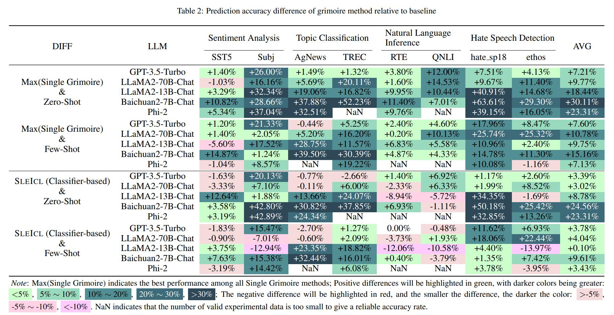

# 📖 Grimoire

Enhance the capabilities of small language models using grimoires.
<p align="center"></p>

## Contents
- [Project Structure](#project-structure)
- [Get Started](#get-started)
- [Results](#results)


## Project Structure
The project is organized into several key directories and modules. Here's an overview of the project structure:
```
.
├── archived      # Store the grimoire and hard samples used in our experiment.
├── assets        # Store project assets, such as images, diagrams, or any visual elements used to enhance the presentation and understanding of the project.
├── configs       # Store configuration files.
├── core          # Core codebase.
│   ├── data      # Data processing module.
│   ├── evaluator # Evaluator module.
│   └── llm       # Load Large Language Models (LLMs) module.
├── data          # Store datasets and data processing scripts.
├── external      # Store the Grimoire Ranking model based on the classifier approach.
├── outputs       # Store experiment output files.
├── prompts       # Store text files used as prompts when interacting with LLMs.
├── stats         # Store experiment statistical results.
└── tests         # Store test code or unit tests.
```


## Get Started

1. Prepare for the environment.
   * `conda create -n grimoire python=3.8.18`
   * `conda activate grimoire`
   * `pip install -r requirements.txt`
2. Run
   * [data/embed.py](data/embed.py) to embed datasets.
   * [data/compute_similarity.py](data/compute_similarity.py) to compute similarity matrix.
   * These are useful when you run similarity-based experiments.
3. Configure
   * the llms in [configs/llm.yaml](configs/llm.yaml).
   * the experiments in [configs/experiment.yaml](configs/experiment.yaml).
   * If it is necessary to reproduce our experiment, you can load the grimoire and hard samples used in this experiment to the current path using the following command: `cp -r ./archived/.cache ./`.
4. Look into [experiments.py](experiments.py) to see how to run experiments.
5. Run [analyst.py](analyst.py) to analyze the results saved in `outputs`.

## Results
<p align="center"></p>
<p align="center"></p>

