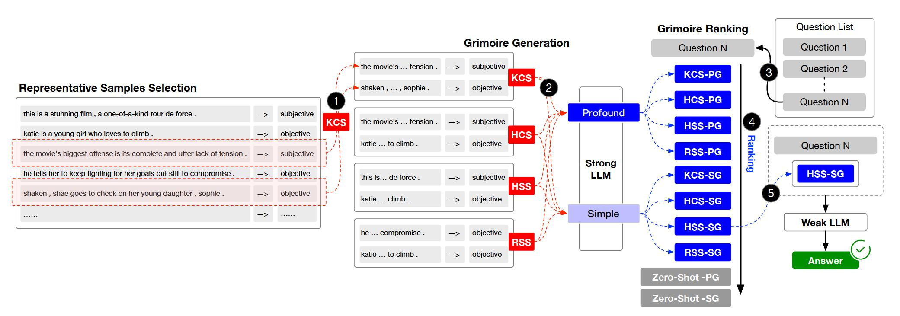

[English](./README.md) | [中文简体](./README.zh_CN.md)

<a href="https://opensource.org/license/apache-2-0/">
    
</a>
<a href="https://github.com/IAAR-Shanghai/Grimoire/issues">
    
</a>
<a href="https://arxiv.org/abs/2401.03385">
    
</a>

# 📖 Grimoire

通过魔法书增强小语言模型的能力。
<p align="center"></p>

## 目录
- [项目结构](#项目结构)
- [快速开始](#快速开始)
- [实验结果](#实验结果)
- [联系我们](#联系我们)
- [引用](#引用)

## 项目结构
该项目结构包括几个关键模块。以下是项目结构的概览：
```
.
├── assets        # 存储项目素材，例如图像、图表或任何用于增强项目演示和理解的素材。
├── configs       # 存储配置文件。
├── core          # 核心代码库。
│   ├── data      # 数据处理模块。
│   ├── evaluator # 评估模块。
│   └── llm       # 加载大型语言模型 (LLMs) 模块。
├── data          # 存储数据集和数据处理脚本。
├── external      # 存储基于分类器方法的魔法书排名模型。
├── outputs       # 存储实验输出文件。
├── prompts       # 存储与LLMs交互时使用的文本文件。
├── stats         # 存储实验统计结果。
└── tests         # 存储测试代码或单元测试。
```

## 快速开始
1. 准备环境
   * `conda create -n grimoire python=3.8.18`
   * `conda activate grimoire`
   * `pip install -r requirements.txt`
2. 运行
   * [data/embed.py](data/embed.py) 以嵌入数据集。
   * [data/compute_similarity.py](data/compute_similarity.py) 以计算相似性矩阵。
   * 当运行基于相似性的实验时，这些步骤很有用。
3. 配置
   * 在 [configs/llm.yaml](configs/llm.yaml) 中配置 LLMS。
   * 在 [configs/experiment.yaml](configs/experiment.yaml) 中配置实验。
4. 查看 [experiments.py](experiments.py) 以了解如何运行实验。
5. 运行 [analyst.py](analyst.py) 以分析保存在 `outputs` 中的结果。

## 实验结果
<p align="center"></p>
<p align="center"></p>


## 联系我们
如有任何问题、反馈或建议，请打开 GitHub Issue。您可以通过 [GitHub Issues](https://github.com/IAAR-Shanghai/Grimoire/issues) 联系我们。

## 引用
```
@article{grimoire,
      title={Grimoire is All You Need for Enhancing Large Language Models}, 
      author={Ding Chen and Shichao Song and Qingchen Yu and Zhiyu Li and Wenjin Wang and Feiyu Xiong and Bo Tang},
      year={2024},
      eprint={2401.03385},
      archivePrefix={arXiv},
      primaryClass={cs.CL}
}
```
